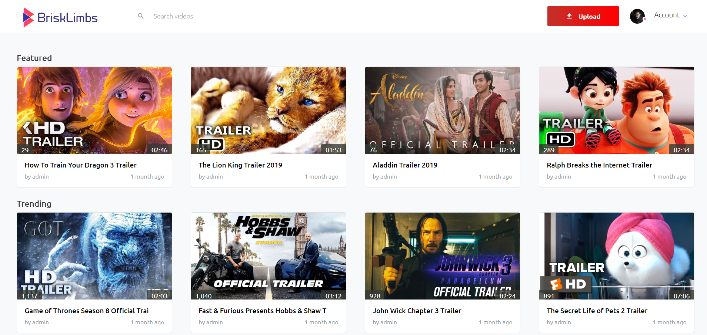
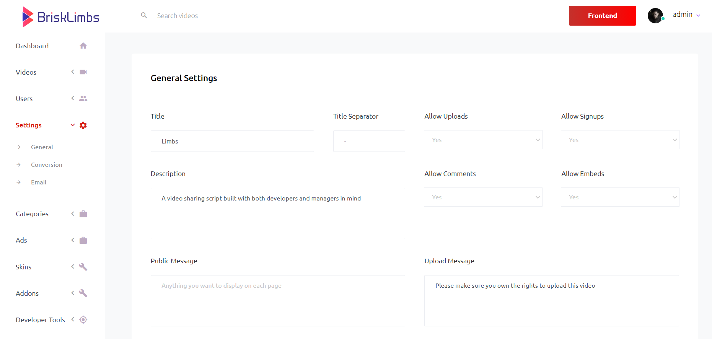

# Project [BriskLimbs](https://github.com/sakydev/brisklimbs)
      

Home Page

Admin Area

### Why
BriskLimbs was love. I created it with no other reason except for sheet enjoyment of learning and building. I didn't use any frameworks and built everything from scratch on purpose. 

### What
A content management system for video-powered websites built with extensive features on frontend and admin area

### Features
- Plugins, themes, players, analytics, detailed logs, developer tools and other admin management essentials
- Upload, watch, share and videos, view favorites, create playlists and manage watch history
- Manage videos, scopes, commenting permissions, visibility and more
- Convert videos in 144, 240, 360, 480, 720 and 1080
- Extract 25 thumbnails with the possibility of changing default and uploading custom ones
- Singular and bulk editing on both admin and frontend
