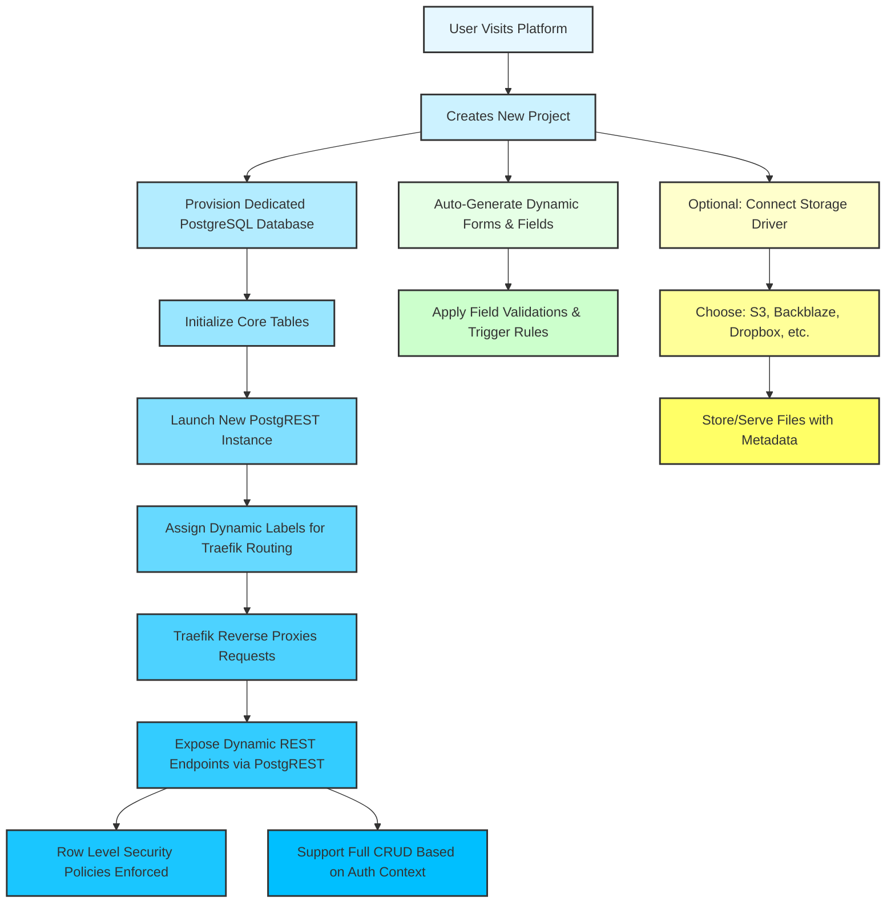

# Project: [Fluxton](https://github.com/fluxton-io/fluxton)

### What
The Fluxton [repo](https://github.com/fluxton-io/fluxton) will do a much better job of explaining

### Why
I built lots of things to tinker with. And I have friends who love doing the same. We often find ourselves excited about an idea. But it either requires using existing services that you don't have much control over. Or building your own infrastructure from scratch. Both options are not optimal.
Fluxton comes a solution. It's blazing fast due to Go's performance, runs anywhere with Docker containers and gives tools out of box to bring ideas to reality. 

### How

