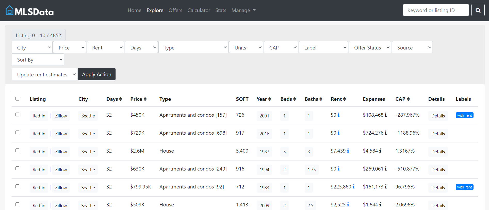
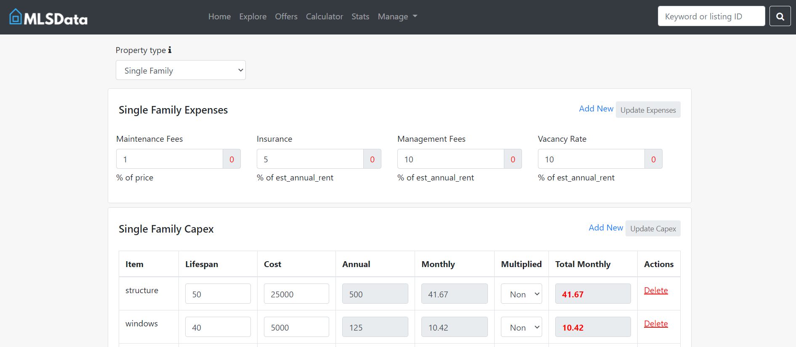

# Project MLSData
      

Homepage

One of algorithm pages

### What
A sophisticated system designed to efficiently crawl rental property data from diverse online sources. Utilizing advanced algorithms, it programmatically analyzes this data to provide tailored investment recommendations. The system boasts a user-friendly interface with customizable algorithms, allowing users to fine-tune their investment strategies according to their unique preferences and goals

### Why
In response to the CEO's quest for a comprehensive property investment tool, we embarked on an in-house development initiative. The platform garnered interest from the CEO's network of investors, who recognized its potential to streamline their property search endeavors. As a result, this platform become a pivotal tool in their investment strategies, providing invaluable insights and opportunities for informed decision-making.

### How
Dashboard powered by PHP, Slim, and Bootstrap. It allowed the creation of crawl sources, algorithms, and cap rate determinating factors. Then Scrapy powered crawling service came into play. It was built with unreliable nature of sources in mind. We had Scrapy crawlers for most sources but also had a mixture of Selenium and Splash

### Challenges
- Websites returning fake data     
Often, websites would start returning fake data upon detection of scrapping. I overcame this problem by introducing Selenium and Splash crawlers. These emulated real user behavior and helped break through the barriers.

- Websites banning IPs      
I implemented a sophisticated proxy rotation engine which ensured our pool of proxies lasted longest time possible and we can keep crawling.

- Website changes and failed crawlers      
Crawlers constantly updated their state in database, sent logs to Grafana and errors to Bugsnag. We had bird eyeview of everything and could promptly fix broken things.
